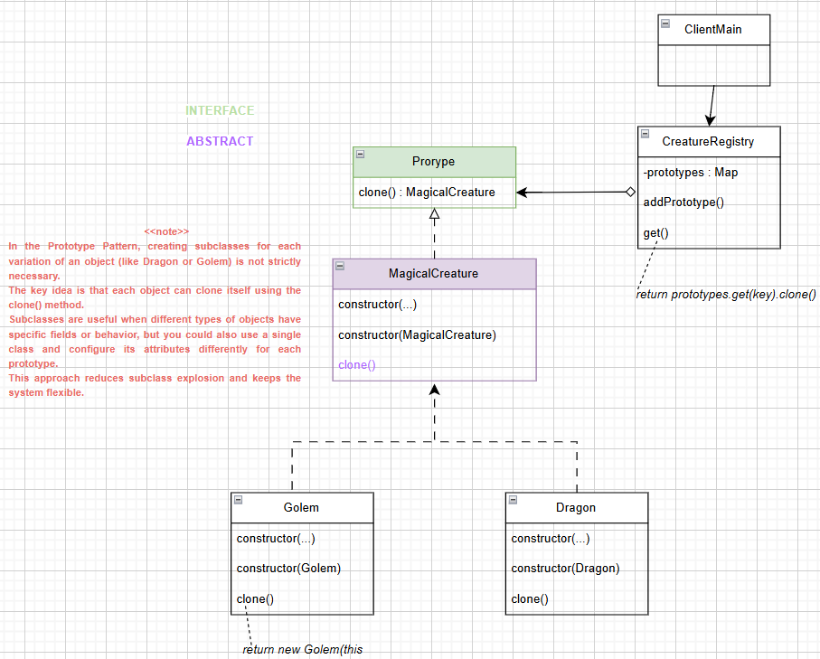
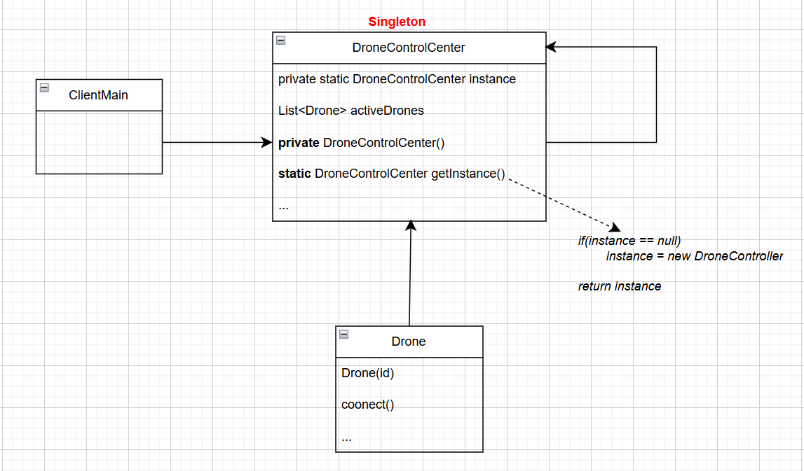
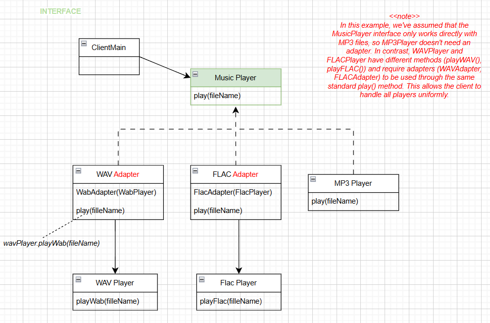

# 🧩 Design Patterns Practice (Java)

A reporitory for practicing and learning the implementation of Design Patterns in Java. 
Each pattern includes a description, a diagram with an example, guidance on when to use it, and its benefits.

---

## 📚 Index


### Creational

- [Factory_Method](#-factory-method)
- [Abstract_Factory](#-abstract-factory)
- [Builder](#-builder-pattern)
- [Prototype](#-prototype-pattern)
- [Singleton](#-singleton-pattern)

### Structuras

- [Adapter](#-adapter-pattern)
---

## 🏭 Factory Method

### 🧠 General Description

- **Abstract Creator:** Declares a factory method.

- **Concrete Subclasses:** Implement this method to create specific objects.

- **Product Interface:** The created objects implement a common interface.

- **Client Usage:** Uses the creator’s interface without depending on concrete classes.

- Separates object creation logic from object usage logic.

### Diagram of example


### 🚀 When to use it

| Situation | Description |
|-----------|------------|
| Unknown object type | When a class cannot anticipate the type of objects it needs to create. |
| Decoupling | When you want to decouple the client from concrete implementations. |
| Frequent new products | When you plan to introduce new product types frequently. |
| Centralized creation | To centralize object creation logic in subclasses. |

### 💡Benefists

| Benefit | Description |
|---------|------------|
| Reduce coupling | Reduces coupling between client and concrete classes. |
| Open/Closed | Easier to extend without modifying existing code. |
| Maintainability | Centralizes creation logic. |
| Flexibility | Add new types without changing existing code. |

### ⚠️ Disadvanteges 

- Can increase the number of classes in the project.

- Might be overkill for simple object creation.

### 🧪 Example output
```text
---- Trying EmailService ----
Sending Email to user...
---- Trying SMSService ----
Sending SMS to user...
---- Trying PushService ----
Sending PUSH message  to user...
```

---

##  🌿 Abstract Factory


### 🧠 General Description

- **Abstract Factory:** Declares interfaces for creating families of related or dependent objects without specifying their concrete classes.  
- **Concrete Factories:** Implement these interfaces to create specific variants of products.  
- **Abstract Products:** Define a common interface for each kind of product (e.g., `Herbivore`, `Carnivore`).  
- **Concrete Products:** Implement the product interfaces, representing specific variants.  
- **Client:** Works only with interfaces — it doesn’t depend on concrete implementations.  

The main goal is to **ensure that products belonging to the same family are used together**, while **decoupling object creation from object usage**.


### Diagram of example


### 🚀 When to use it

| Situation | Description |
|-----------|-------------|
| Families of related objects | When a system needs to create groups of related or dependent objects together. |
| Decoupling | When client code should not depend on concrete classes. |
| Multiple product variants | When you want to switch entire families of products easily. |
| Consistency | To ensure that compatible products are used together. |

### 💡Benefists

| Benefit | Description |
|----------|-------------|
| Reduced coupling | The client depends only on abstract interfaces, not concrete classes. |
| Open/Closed Principle | You can add new product families without modifying existing code. |
| Consistency | Ensures that products from the same family are compatible. |
| Centralized creation | Each factory handles the creation of its own family. |

### ⚠️ Disadvanteges

- Increases the number of classes and interfaces in the project.  
- Can be overkill for simple object creation scenarios.


### 🧪 Example output


```text
--- Jungle animals ----
The deer eats grass
The lion eats the deer.
--- Farm animals ----
The cow eats grass.
The wolf eats the cow.
```

---

## 🍕 Builder Pattern 

### 🧠 General Description

- **Builder:** Declares an interface for creating parts of a complex object (`Pizza`) step by step.  
- **Concrete Builders:** Implement the Builder interface to construct specific variants of the product (`AmericanPizzaBuilder`, `ItalianPizzaBuilder`, `VegetarianPizzaBuilder`).  
- **Product:** The complex object being built (`Pizza`), which may consist of several parts: size, dough, sauce, ingredients, stuffed crust, etc.  
- **Director:** Defines the order in which the steps are executed to build a specific pizza configuration.  
- **Client:** Uses the Director and a Builder to obtain a fully constructed Pizza without depending on its concrete classes.  

The main goal is to **separate the construction of a complex object from its representation**, allowing the same construction process to create different types of pizzas.

### Diagram of example


### 🚀 When to use it

| Situation | Description |
|-----------|-------------|
| Complex objects | When an object requires multiple steps to be created. |
| Variants of a product | When the same construction process can produce different types of products. |
| Decoupling construction | When the client should not depend on concrete classes. |
| Step-by-step construction | When you want to construct an object piece by piece with flexibility. |


### 💡 Benefits

| Benefit | Description |
|---------|-------------|
| Flexibility | Allows creating different representations of a product using the same construction process. |
| Separation of concerns | The construction logic is separated from the product representation. |
| Reusability | Builders and Director can be reused to construct different product configurations. |
| Clear process | Step-by-step construction ensures clarity and maintainability. |


### ⚠️ Disadvantages

- Increases the number of classes in the project.  
- May be overkill for simple objects that don’t require complex construction.  


### 🧪 Example output
```
American Pizza:{size=LARGE, dough=THICK, sauce=BBQ, ingredients=[Pepperoni, Bacon, Chicken, Mozzarella, Cheddar, Onion], stuffedCrust=true}
-------------------------------------------------
Italian Pizza:{size=MEDIUM, dough=THIN, sauce=TOMATO, ingredients=[Mozzarella, Basil, Cherry tomatoes, Black olives, Prosciutto, Olive oil], stuffedCrust=false}
-------------------------------------------------
Vegetarian Pizza:{size=SMALL, dough=WHOLE_WHEAT, sauce=PESTO, ingredients=[Mozzarella, Mushrooms, Peppers, Onion, Cherry tomatoes, Olive oil], stuffedCrust=false}
```

---

## 🐉 Prototype Pattern

### 🧠 General Description

- **Prototype:** Specifies an interface (`Prototype`) for cloning itself.  
- **Concrete Prototypes:** Implement the Prototype interface (`Dragon`, `Golem`) and define a method to return a copy of themselves.  
- **CreatureRegistry:** Maintains a collection of prefabricated prototypes. Clients can request a clone by key without knowing the concrete classes.  
- **Client:** Requests a clone of a prototype rather than creating a new instance from scratch.  

The main goal is to **create new objects by cloning existing prototypes**, avoiding the need to repeatedly initialize complex objects or create numerous subclasses.

### Diagram of example



### 🚀 When to use it
| Situation | Description |
|-----------|-------------|
| Many similar objects | When objects share most fields and differ only in some attributes. |
| Expensive initialization | When creating a new object from scratch is costly. |
| Avoid subclass explosion | When creating variations of an object using subclasses would produce too many classes. |
| Prefabricated configurations | When you want preconfigured prototypes ready to clone. |

### 💡 Benefits

| Benefit | Description |
|---------|-------------|
| Performance | Cloning an existing object can be faster than building a new one from scratch. |
| Simplifies object creation | Avoids repeating complex initialization for every new object. |
| Flexibility | You can create new instances dynamically at runtime from existing prototypes. |
| Reduced subclassing | Avoids creating multiple subclasses for small variations. |

### ⚠️ Disadvantages

- Requires careful implementation of `clone()` to avoid shared references when doing deep cloning.  
- Can increase memory usage if many prefabs are stored in the registry.  
- Cloning logic may become complex for objects with deep or circular references.

### 🧪 Example output
```
Available prototypes:
StoneGolem
IceDragon
FireDragon
AbsoluteGolem

Are the same dragon d1 & d2?
false

Are clones and independents dragons?
true

List adding new Prototype:
StoneGolem
MudGolem
IceDragon
FireDragon
AbsoluteGolem
```

---

## 🛸 Singleton Pattern

### 🧠 General Description
- **Singleton:** Ensures that **only one instance** of a class exists throughout the application and provides a **global access point** to it.  
- **Context in this example:** The `DroneControlCenter` acts as the single instance that coordinates all drones in the system.  
- **Clients:** The `Drone` objects represent entities that interact with the Singleton to register themselves, send data, and receive commands.  

The main goal of this pattern is to **restrict the instantiation of a class to a single object** while providing a **centralized access point** that can be used across different parts of the program.


### Diagram of example




### 🚀 When to use it

| Situation | Description |
|-----------|-------------|
| Single shared resource | When exactly one instance must coordinate actions across the system (e.g., configuration manager, database connection, logging system). |
| Global access point | When multiple components need a single object accessible from anywhere. |
| Controlled instantiation | When you need to prevent uncontrolled creation of instances. |
| Thread safety required | When multiple threads might attempt to access or create the Singleton at the same time. |

### 💡 Benefits

| Benefit | Description |
|---------|-------------|
| Single instance | Guarantees that only one object exists throughout the application. |
| Global access | Provides a simple and controlled way to access the instance. |
| Resource management | Avoids conflicts and saves resources by centralizing access. |
| Thread-safe option | Can be implemented safely in multithreaded environments using double-checked locking. |

### ⚠️ Disadvantages

- Can introduce **global state**, making testing and debugging harder.  
- May **violate the Single Responsibility Principle** (if it handles too many concerns).  
- **Tight coupling:** Clients depend on the Singleton class directly.  
- May cause issues in concurrent or distributed systems if not properly synchronized.  


### 🧪 Example output
```
=== Test 1: Basic singleton ===
Drone control center initialized
Hava c1 & c2 same instance? true
HashCode c1: 1746572565
HashCode c2: 1746572565

=== Test 2: Basic singleton ===
Dronne1 registred.
Drone 1 connected to control center.
Dronne2 registred.
Drone 2 connected to control center.
Dronne3 registred.
Drone 3 connected to control center.
Active drones: [Dronne1, Dronne2, Dronne3]
Sending command: "Return to base" to all drones...
Drone 1 received command: Return to base
Drone 2 received command: Return to base
Drone 3 received command: Return to base

=== Test 3: Thread-safe test ===
DroneThread-6 -> 1746572565
DroneThread-8 -> 1746572565
DroneThread-3 -> 1746572565
DroneThread-1 -> 1746572565
DroneThread-2 -> 1746572565

```
---

## 🎸 Adapter Pattern

### 🧠 General Description
- **Adapter:** Allows classes with **incompatible interfaces** to work together by converting the interface of a class into another interface that a client expects.  
- **Context in this example:** The `MusicPlayer` interface defines a standard `play()` method. Classes like `MP3Player`, `WAVPlayer`, and `FLACPlayer` have different ways of playing audio. Adapters (`WAVAdapter`, `FLACAdapter`) allow these players to be used interchangeably.  
- **Clients:** The main program (`Main`) only interacts with `MusicPlayer` objects, without worrying about the underlying format or implementation.

The main goal of this pattern is to **allow objects with incompatible interfaces to collaborate**, promoting **flexibility and code reuse** without modifying existing classes.


### Diagram of example



### 🚀 When to use it

| Situation | Description |
|-----------|-------------|
| Incompatible interfaces | When you have classes that cannot work together because their methods or interfaces differ. |
| Code reuse | When you want to use existing classes without modifying them. |
| Flexible integration | When you need to integrate third-party libraries or legacy code into your system. |
| Unified API | When you want your client code to interact with a single, consistent interface. |

---

### 💡 Benefits

| Benefit | Description |
|---------|-------------|
| Compatibility | Lets classes with incompatible interfaces work together. |
| Code reuse | You can use existing code without modification. |
| Decoupling | The client depends on the adapter interface, not on specific implementations. |
| Flexible extension | Adding support for new formats only requires creating a new adapter. |

---

### ⚠️ Disadvantages

- Adds **extra classes** (one adapter per incompatible class).  
- Can introduce a **small performance overhead** due to delegation.  
- May **increase complexity** if adapters are overused.  
- Requires careful design to avoid adapters becoming “God objects” that handle too many conversions.  

---

### 🧪 Example output

```
 Playing songs with Universal Player:

reproducing <Blinding Lights_TheWeekend>.mp3
FLACAdapter ? using an external FLACPlayer...
reproducing <Blinding Lights_TheWeekend>.flac
WAVAdapter ? using an external WAVPlayer...
reproducing <Blinding Lights_TheWeekend>.wav

```

---