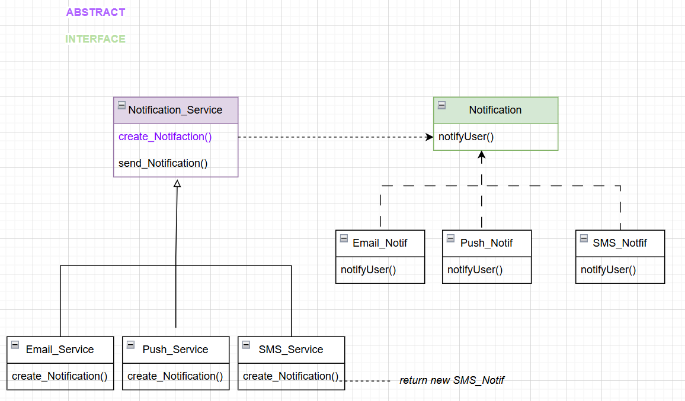
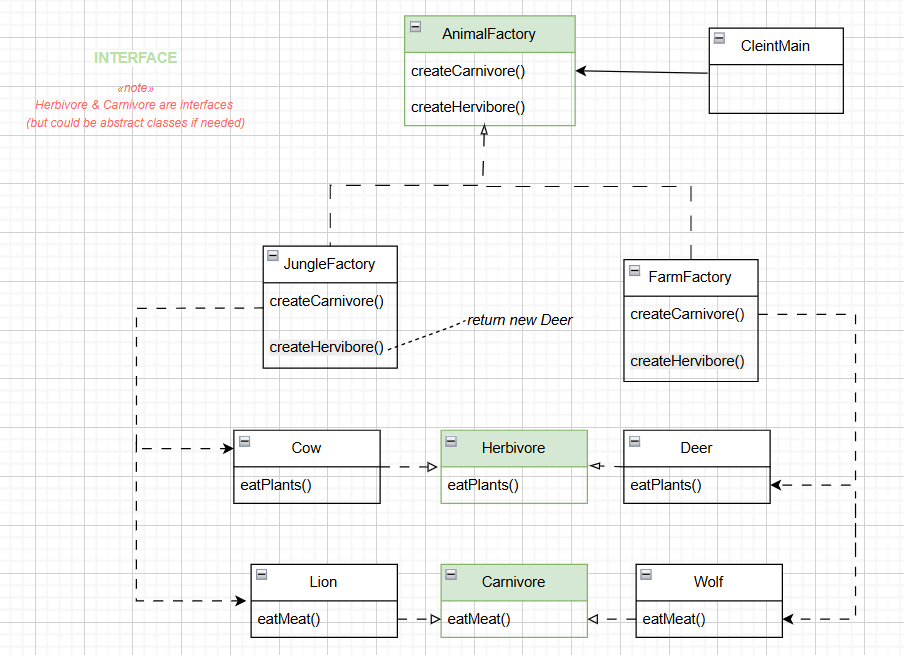
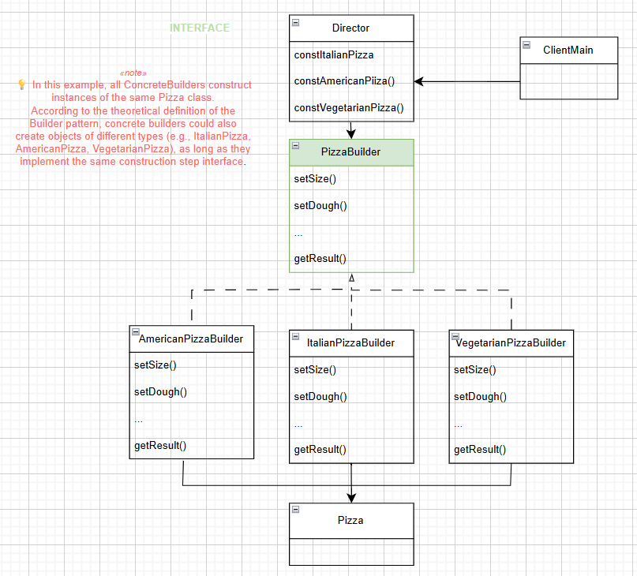

# 🧩 Design Patterns Practice (Java)

A reporitory for practicing and learning the implementation of Design Patterns in Java. 
Each pattern includes a description, a diagram with an example, guidance on when to use it, and its benefits.

---

## 📚 Index

- [Factory_Method](#-factory-method)
- [Abstract_Factory](#-abstract-factory)
- [Singleton](#-builder-pattern)
- [Observer](#observer)
- [Strategy](#strategy)
- [Decorator](#decorator)

---

## 🏭 Factory Method

### 🧠 General Description

- **Abstract Creator:** Declares a factory method.

- **Concrete Subclasses:** Implement this method to create specific objects.

- **Product Interface:** The created objects implement a common interface.

- **Client Usage:** Uses the creator’s interface without depending on concrete classes.

- Separates object creation logic from object usage logic.

### Diagram of example




### 🚀 When to use it

| Situation | Description |
|-----------|------------|
| Unknown object type | When a class cannot anticipate the type of objects it needs to create. |
| Decoupling | When you want to decouple the client from concrete implementations. |
| Frequent new products | When you plan to introduce new product types frequently. |
| Centralized creation | To centralize object creation logic in subclasses. |

### 💡Benefists

| Benefit | Description |
|---------|------------|
| Reduce coupling | Reduces coupling between client and concrete classes. |
| Open/Closed | Easier to extend without modifying existing code. |
| Maintainability | Centralizes creation logic. |
| Flexibility | Add new types without changing existing code. |

### ⚠️ Disadvanteges 

- Can increase the number of classes in the project.

- Might be overkill for simple object creation.

### 🧪 Example output
```text
---- Trying EmailService ----
Sending Email to user...
---- Trying SMSService ----
Sending SMS to user...
---- Trying PushService ----
Sending PUSH message  to user...
```

---

##  🌿 Abstract Factory


### 🧠 General Description

- **Abstract Factory:** Declares interfaces for creating families of related or dependent objects without specifying their concrete classes.  
- **Concrete Factories:** Implement these interfaces to create specific variants of products.  
- **Abstract Products:** Define a common interface for each kind of product (e.g., `Herbivore`, `Carnivore`).  
- **Concrete Products:** Implement the product interfaces, representing specific variants.  
- **Client:** Works only with interfaces — it doesn’t depend on concrete implementations.  

The main goal is to **ensure that products belonging to the same family are used together**, while **decoupling object creation from object usage**.


### Diagram of example




### 🚀 When to use it

| Situation | Description |
|-----------|-------------|
| Families of related objects | When a system needs to create groups of related or dependent objects together. |
| Decoupling | When client code should not depend on concrete classes. |
| Multiple product variants | When you want to switch entire families of products easily. |
| Consistency | To ensure that compatible products are used together. |

### 💡Benefists

| Benefit | Description |
|----------|-------------|
| Reduced coupling | The client depends only on abstract interfaces, not concrete classes. |
| Open/Closed Principle | You can add new product families without modifying existing code. |
| Consistency | Ensures that products from the same family are compatible. |
| Centralized creation | Each factory handles the creation of its own family. |

### ⚠️ Disadvanteges

- Increases the number of classes and interfaces in the project.  
- Can be overkill for simple object creation scenarios.


### 🧪 Example output


```text
--- Jungle animals ----
The deer eats grass
The lion eats the deer.
--- Farm animals ----
The cow eats grass.
The wolf eats the cow.
```

---

## 🍕 Builder Pattern 

### 🧠 General Description

- **Builder:** Declares an interface for creating parts of a complex object (`Pizza`) step by step.  
- **Concrete Builders:** Implement the Builder interface to construct specific variants of the product (`AmericanPizzaBuilder`, `ItalianPizzaBuilder`, `VegetarianPizzaBuilder`).  
- **Product:** The complex object being built (`Pizza`), which may consist of several parts: size, dough, sauce, ingredients, stuffed crust, etc.  
- **Director:** Defines the order in which the steps are executed to build a specific pizza configuration.  
- **Client:** Uses the Director and a Builder to obtain a fully constructed Pizza without depending on its concrete classes.  

The main goal is to **separate the construction of a complex object from its representation**, allowing the same construction process to create different types of pizzas.

### Diagram of example




### 🚀 When to use it

| Situation | Description |
|-----------|-------------|
| Complex objects | When an object requires multiple steps to be created. |
| Variants of a product | When the same construction process can produce different types of products. |
| Decoupling construction | When the client should not depend on concrete classes. |
| Step-by-step construction | When you want to construct an object piece by piece with flexibility. |


### 💡 Benefits

| Benefit | Description |
|---------|-------------|
| Flexibility | Allows creating different representations of a product using the same construction process. |
| Separation of concerns | The construction logic is separated from the product representation. |
| Reusability | Builders and Director can be reused to construct different product configurations. |
| Clear process | Step-by-step construction ensures clarity and maintainability. |


### ⚠️ Disadvantages

- Increases the number of classes in the project.  
- May be overkill for simple objects that don’t require complex construction.  


### 🧪 Example output
```
American Pizza:{size=LARGE, dough=THICK, sauce=BBQ, ingredients=[Pepperoni, Bacon, Chicken, Mozzarella, Cheddar, Onion], stuffedCrust=true}
-------------------------------------------------
Italian Pizza:{size=MEDIUM, dough=THIN, sauce=TOMATO, ingredients=[Mozzarella, Basil, Cherry tomatoes, Black olives, Prosciutto, Olive oil], stuffedCrust=false}
-------------------------------------------------
Vegetarian Pizza:{size=SMALL, dough=WHOLE_WHEAT, sauce=PESTO, ingredients=[Mozzarella, Mushrooms, Peppers, Onion, Cherry tomatoes, Olive oil], stuffedCrust=false}
```

---

## 🍕 Builder Pattern 

### 🧠 General Description

### Diagram of example

### 🚀 When to use it

### 💡 Benefits

### ⚠️ Disadvantages

### 🧪 Example output
```

```

---